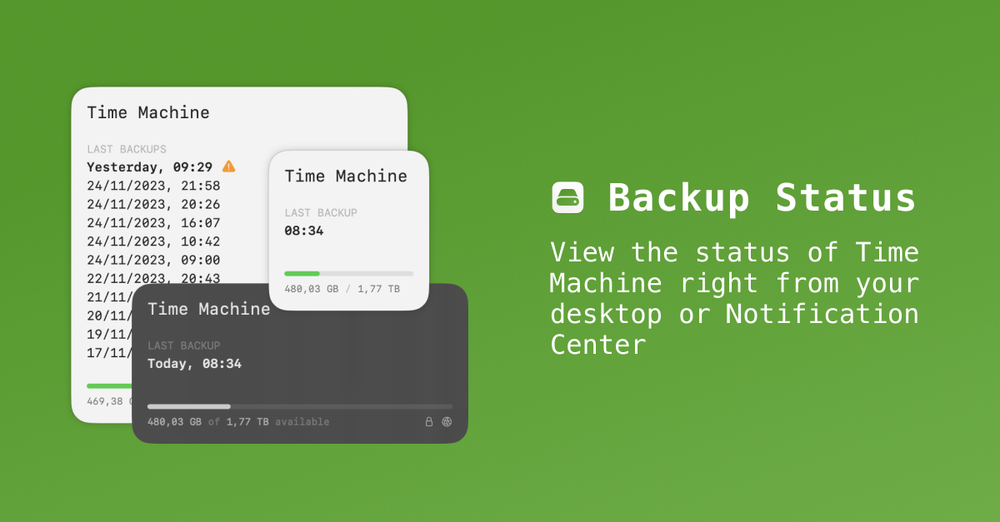

# Backup Status

[Backup Status](https://backupstatus.app) introduces a widget for your Mac, allowing you to view the status of Time Machine right from your desktop or Notification Center.

## Features

- View the status of your latest Time Machine backups on your desktop or Notification Center.

- Configure the backup disk for which you want to see the status.

- 3 widget sizes to choose from: small, medium or large.

- See details of a backup disk, e.g., its encryption state.

## Download

[Download](https://gum.co/backupstatus) Backup Status via Gumroad or check out this repository and build it yourself.

## Frequently asked questions

### How can I get support?

First, check the [frequently asked questions](https://github.com/nielsmouthaan/backup-status#frequently-asked-questions). If your question isn't answered, [create](https://github.com/nielsmouthaan/backup-status/issues/new) an issue.

### How can I request a feature?

[Create](https://github.com/nielsmouthaan/backup-status/issues/new) an issue after [checking](ttps://github.com/nielsmouthaan/backup-status/issues) it isn't already asked for.

### The app doesn't start. What can I do?

Make sure Backup Status is copied into your Applications directory and run from there.

### Why do I need to grant permissions?

Backup Status is a [sandboxed](https://developer.apple.com/documentation/security/app_sandbox/) application ensuring the protection of your system and data. It needs your explicit permission to read your Time Machine configuration to access its status. Since this is a read-only permission, Backup Status isn't able to modify its configuration or any other file on your Mac.

### Why do I need Backup Status to start at launch?

Backup Status contains an agent utility that observes changes to your Time Machine configuration and stores its status so the widget can access and display it. Without this utility running, the widget is unable to do this. To avoid starting this utility manually, allow it to start at launch.

### How can I uninstall Backup Status?

1. Open Backup Status from your Applications directory.
2. Click `Quit & uninstall` at the bottom; this will stop the utility from running.
3. [Remove](https://support.apple.com/guide/mac-help/add-and-customize-widgets-mchl52be5da5/mac) the widget from your desktop and/or Notification Center.
4. [Remove](https://support.apple.com/en-us/102610) Backup Status by dragging it to the Trash.

## License

Backup Status is available under the MIT license. See [LICENSE](https://github.com/nielsmouthaan/backup-status/blob/main/LICENSE) for more info.
